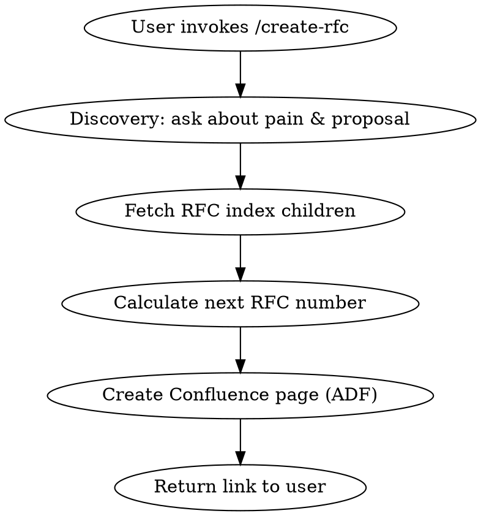

# Create RFC

Create a new Engineering RFC in the ENGOPS Confluence space with automatic numbering and problem discovery.

## Confluence Details

| Property | Value |
|---|---|
| Cloud ID | `sonatus.atlassian.net` |
| Space ID | `1659797534` |
| Space Key | `ENGOPS` |
| RFC Index Page ID | `3404005382` |

## Workflow



### Step 1: Discovery

Use `AskUserQuestion` with these questions (all in one call):

1. **RFC Title** — "What's a short title for this RFC?" (free text, no options — ask as a single question with descriptive options the user will override via "Other")
2. **Pain / Problem** — "What pain or problem are you trying to solve? Describe the current state and why it's insufficient."
3. **Proposed Solution** — "In 1-2 sentences, what's the high-level approach you're proposing?"
4. **Owner & Team** — "Who is the author and which team owns this?"

Since `AskUserQuestion` requires options, use this pattern for free-text questions: provide 2 placeholder options and expect the user to select "Other" to type their answer. Example options: `["Placeholder — select Other to type your answer", "See above"]`.

Collect all four answers. If the user provides them upfront in their message (e.g., "create an RFC about X because Y"), skip redundant questions.

### Step 2: Auto-Number

Fetch child pages of the RFC Index:

```
mcp__plugin_atlassian_atlassian__getConfluencePageDescendants
  cloudId: "sonatus.atlassian.net"
  pageId: "3404005382"
```

Parse titles matching `RFC-(\d+)` to find the highest existing number. Next RFC = highest + 1, zero-padded to 3 digits (e.g., `RFC-002`).

If no RFCs exist yet, start at `RFC-001`.

### Step 3: Create Page

Create the page using **ADF format** (required for Page Properties Report macro to work).

```
mcp__plugin_atlassian_atlassian__createConfluencePage
  cloudId: "sonatus.atlassian.net"
  spaceId: "1659797534"
  parentId: "3404005382"
  title: "RFC-NNN: <user's title>"
  status: "current"
  contentFormat: "adf"
  body: <ADF JSON — see template below>
```

### ADF Template

The page body must include:

1. **Page Properties macro** (`bodiedExtension` with `extensionKey: "details"`) containing a table with:

| Property | Value |
|---|---|
| **RFC Number** | `RFC-NNN` |
| **Status** | Draft (yellow status node) |
| **Owner** | User's name |
| **Team** | User's team |
| **Created** | Today's date (YYYY-MM-DD) |
| **Last Updated** | Today's date (YYYY-MM-DD) |
| **Review Date** | TBD |

2. **Section headings and content** matching this structure:

```
## 1. Executive Summary
<Synthesize from user's pain + proposed solution into ~200 words>

## 2. OKR Alignment
<Empty table: OKR | Weight | How This Maps>

## 3. Problem Statement
<User's pain/problem answer, lightly edited for clarity>

## 4. Proposed Solution
<User's proposed solution answer>

## 5. Alternatives Considered
<Empty table: Alternative | Pros | Cons | Why Not>

## 6. Rollout Plan
<Empty table: Phase | Timeline | Scope | Mode>

## 7. Risks & Mitigations
<Empty table: Risk | Impact | Mitigation>

## 8. Success Criteria
<Bullet placeholder>

## 9. Open Questions
<Numbered placeholder>
```

### ADF Structure Reference

Build the ADF doc node (`{"version": 1, "type": "doc", "content": [...]}`) with these node types:

- **Page Properties macro**: `bodiedExtension` with `extensionType: "com.atlassian.confluence.macro.core"`, `extensionKey: "details"`
- **Status badge**: `{"type": "status", "attrs": {"text": "Draft", "color": "yellow"}}`
- **Bold text**: `{"type": "text", "text": "...", "marks": [{"type": "strong"}]}`
- **Headings**: `{"type": "heading", "attrs": {"level": 2}, "content": [...]}`
- **Tables**: `{"type": "table", "attrs": {"isNumberColumnEnabled": false, "layout": "default"}, "content": [tableRows...]}`
- **Horizontal rules**: `{"type": "rule"}`
- **Bullet lists**: `{"type": "bulletList", "content": [{"type": "listItem", "content": [...]}]}`
- **Ordered lists**: `{"type": "orderedList", "content": [{"type": "listItem", "content": [...]}]}`

Separate each major section with a `rule` node (horizontal line) to match the template's visual style.

### Step 4: Add the `rfc` Label

The RFC Index uses a Page Properties Report macro filtered by `label = "rfc"`. Without this label, the new page **will not appear in the index**.

There is no MCP tool for adding Confluence labels. After creating the page, instruct the user:

> **Action required:** Open the page in Confluence, click the label icon (bottom of page or `L` shortcut), and add the label `rfc`. This makes it appear in the RFC Index table.

### Step 5: Report

After successful creation, report:
- RFC number assigned
- Link to the new page (construct from the response or use `webUrl`)
- Remind: add the `rfc` label (Step 4)
- Remind: fill in remaining sections in Confluence

## Common Mistakes

| Mistake | Fix |
|---|---|
| Using markdown contentFormat | Must use ADF — markdown doesn't support Page Properties macro, and the RFC Index table won't pick up the page |
| Forgetting `parentId` | Page must be a child of the RFC Index (3404005382) for the index to include it |
| Wrong status color | Draft = `yellow`, In Review = `blue`, Accepted = `green`, Rejected = `red` |
| Not zero-padding RFC number | Always 3 digits: `RFC-001`, `RFC-002`, etc. |
| Missing `rfc` label | Page won't appear in the RFC Index. Remind user to add label manually. |
